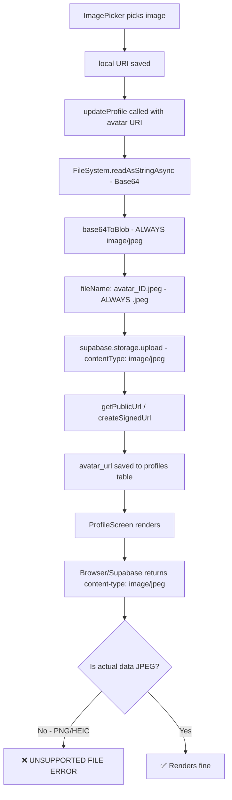
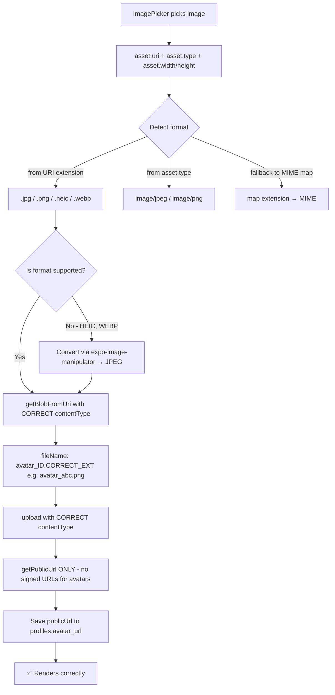

# Image Upload Fix Plan — Avatar Storage & Download

## Problem

Users report "unsupported file" errors when downloading profile avatars from Supabase Storage. The root cause is a **MIME-type / content-type mismatch** between what's uploaded and what's served.

---

## Current Architecture (Buggy)



### Root Causes

| # | Issue | File:Line | Impact |
|---|-------|-----------|--------|
| **R1** | `base64ToBlob(contentType='image/jpeg')` is hardcoded | [`AuthContext.js:1167`](frontend/src/context/AuthContext.js:1167) | Always tags blob as JPEG regardless of source |
| **R2** | `extension = blob.type?.split('/')[1]` always → `jpeg` | [`AuthContext.js:1244`](frontend/src/context/AuthContext.js:1244) | File stored as `.jpeg` even for PNG |
| **R3** | `upload({ contentType: blob?.type \|\| 'image/jpeg' })` | [`AuthContext.js:1222`](frontend/src/context/AuthContext.js:1222) | Reinforces the wrong content type |
| **R4** | Signed URL with 24h TTL | [`AuthContext.js:1264`](frontend/src/context/AuthContext.js:1264) | URL expires, download fails after 24h |
| **R5** | No format detection from URI | Entire `getBlobFromUri` | Cannot handle HEIC, WebP, GIF |

---

## Target Architecture (Fixed)



---

## Fix Steps (Execution Order)

### Step 1 — Extract MIME type from URI/hybrid input

**File:** [`frontend/src/context/AuthContext.js`](frontend/src/context/AuthContext.js)

Add a helper function that reliably detects image format:

```javascript
// New helper: detect MIME type and file extension from any URI
const getImageMetadata = (uri) => {
  // Map extensions to MIME types
  const MIME_MAP = {
    jpg:  'image/jpeg',
    jpeg: 'image/jpeg',
    png:  'image/png',
    gif:  'image/gif',    // Optional support
    webp: 'image/webp',   // Optional support
    heic: 'image/heic',   // Unsupported natively by RN Image
    heif: 'image/heif',
  };

  // Try to extract from URI path
  const match = uri.match(/\.(\w+)(?:\?|$)/);
  const ext = (match ? match[1].toLowerCase() : 'jpg');
  const mimeType = MIME_MAP[ext] || 'image/jpeg';

  return { extension: ext === 'jpeg' ? 'jpg' : ext, mimeType };
};
```

**Insert at:** ~line 133, after the `handleError` function.

---

### Step 2 — Fix `getBlobFromUri` to pass correct content type

**File:** [`frontend/src/context/AuthContext.js`](frontend/src/context/AuthContext.js), lines 1190–1214

Replace the existing `getBlobFromUri` function. The key change: accept the `mimeType` parameter and decode only the supported raw formats (skip data: URIs for local files):

```javascript
const getBlobFromUri = async (inputUri, mimeType) => {
  try {
    if (inputUri.startsWith('file://') || inputUri.startsWith('content://')) {
      const base64 = await FileSystem.readAsStringAsync(inputUri, {
        encoding: FileSystem.EncodingType.Base64,
      });
      return base64ToBlob(base64, mimeType);  // ← uses correct mimeType
    }

    if (inputUri.startsWith('data:image')) {
      const response = await fetch(inputUri);
      return await response.blob();
    }

    // Remote URLs: just fetch
    const response = await fetch(inputUri);
    return await response.blob();
  } catch (fetchErr) {
    console.warn('[STORAGE] Failed to create blob:', fetchErr?.message);
    throw fetchErr;
  }
};
```

---

### Step 3 — Fix avatar upload section to use correct metadata

**File:** [`frontend/src/context/AuthContext.js`](frontend/src/context/AuthContext.js), lines 1163–1283

Replace the entire avatar handling block inside `updateProfile`:

```javascript
// Detect format from URI
const metadata = getImageMetadata(uri);
let { extension, mimeType } = metadata;

// Normalize unsupported formats to JPEG
const SUPPORTED = ['image/jpeg', 'image/png'];
if (!SUPPORTED.includes(mimeType)) {
  console.log(`[PROFILE] Unsupported format ${mimeType}, converting to JPEG...`);
  extension = 'jpg';
  mimeType = 'image/jpeg';
  // TODO: Optionally use expo-image-manipulator here for HEIC→JPEG
}

const blob = await getBlobFromUri(uri, mimeType);
if (!blob || !blob.size || blob.size < 100) {
  return { success: false, message: 'Image file is empty or invalid.' };
}

const fileName = `avatar_${user.id}.${extension}`;

const { error: uploadError } = await supabase.storage
  .from('avatars')
  .upload(fileName, blob, {
    contentType: mimeType,  // ← CORRECT MIME, not hardcoded
    upsert: true,
  });

if (uploadError) {
  return { success: false, message: 'Image upload failed: ' + uploadError.message };
}

// Use PUBLIC URL only — no signed URLs that expire
const { data: urlData } = supabase.storage
  .from('avatars')
  .getPublicUrl(fileName);

avatarUrl = urlData.publicUrl;
```

---

### Step 4 — Remove signed URL logic

**File:** [`frontend/src/context/AuthContext.js`](frontend/src/context/AuthContext.js), lines 1262–1273

Delete the `createSignedUrl` call entirely. Avatars are public content and don't need signed URLs. The `getPublicUrl` on line 1254–1256 already provides a permanent URL.

---

### Step 5 — Add better error feedback in ProfileScreen

**File:** [`frontend/src/screens/ProfileScreen.js`](frontend/src/screens/ProfileScreen.js), lines 326–330

The upload overlay already exists but only shows a generic "Upload Failed" message. Pipe the actual error through:

```javascript
// When upload fails, show the actual reason
if (res?.success) {
  // ... existing success flow ...
} else {
  // Show specific error from updateProfile response
  setUploadOverlay('error');
  // Optional: store error message in state for display
  const reason = res?.message || 'Something went wrong.';
  Alert.alert('Upload Failed', reason);
  setTimeout(() => setUploadOverlay('hidden'), 2200);
}
```

---

### Step 6 — Supabase Storage Bucket Configuration

Check that the `avatars` bucket has **public read access**. In Supabase Dashboard → Storage → Buckets → avatars → Policies:

```sql
-- Check if this policy exists
CREATE POLICY "Public read access for avatars"
ON storage.objects FOR SELECT
USING (bucket_id = 'avatars');
```

If the bucket doesn't allow public reads, `getPublicUrl` will return a URL but downloads will fail with 403.

---

## Files to Modify (Summary)

| File | Change |
|------|--------|
| [`frontend/src/context/AuthContext.js`](frontend/src/context/AuthContext.js) | Add `getImageMetadata()` helper + refactor `getBlobFromUri()` + fix avatar upload block |
| [`frontend/src/screens/ProfileScreen.js`](frontend/src/screens/ProfileScreen.js) | Improve error messaging in upload overlay |
| Supabase Dashboard | Verify public read policy on `avatars` bucket |

## Risk Assessment

| Risk | Mitigation |
|------|------------|
| HEIC images from iOS still cause issues | Use `expo-image-manipulator` to convert to JPEG before upload (Step 7, future enhancement) |
| Existing broken avatars in storage | Existing `.jpeg` files with PNG data will remain broken; users need to re-upload |
| Large image files (>5MB) | Add a size check in `getBlobFromUri` and reject or compress via ImagePicker's `quality: 0.5` (already set) |

---

## Implementation Notes (Completed Changes)

### AuthContext.js — Changes Applied

1. **Added `getImageMetadata()` helper** (~line 182): Detects file extension from URI and maps it to correct MIME type. Handles: jpg, jpeg, png, gif, webp, heic, heif, bmp.

2. **Fixed `getBlobFromUri()`** (~line 1214): Now accepts `mimeType` parameter instead of hardcoding `'image/jpeg'`. The caller passes the detected MIME type.

3. **Refactored avatar upload block** (~line 1255):
   - Uses `getImageMetadata(uri)` to detect format before creating blob
   - Unsupported formats (HEIC, WebP, etc.) are normalized to JPEG
   - Uses correct `extension` and `mimeType` throughout (blob, fileName, upload contentType)
   - Public URL only — no more signed URLs that expire

4. **Removed signed URL logic** (~line 1286-1295 deleted): The entire `createSignedUrl` block was removed. Only `getPublicUrl` is used now.

### ProfileScreen.js — Changes Applied

1. **Added `uploadErrorMessage` state**: Stores the actual error message from `updateProfile()`.

2. **Error paths now capture the real message**: Both the `res?.message` path and the `catch` block set `uploadErrorMessage`.

3. **Error overlay displays actual reason**: Instead of generic "Something went wrong", shows the captured `uploadErrorMessage`.

4. **Error display timeout increased**: 2200ms → 3000ms for better readability.

### Supabase Bucket Policy — Manual Verification Required

Run this SQL in the Supabase SQL Editor to verify/create the public read policy:

```sql
-- Check existing policies
SELECT * FROM storage.policies WHERE bucket_id = 'avatars';

-- Create if missing (must be run in Supabase Dashboard → SQL Editor)
CREATE POLICY "Public read access for avatars"
ON storage.objects FOR SELECT
USING (bucket_id = 'avatars');
```

Without this policy, `getPublicUrl()` returns a valid URL but downloads fail with HTTP 403.

## Verification Checklist

- [ ] Upload a PNG image → downloads and renders correctly
- [ ] Upload a JPEG image → downloads and renders correctly
- [ ] Re-upload (upsert) a different format → old cache invalidated, new format serves correctly
- [ ] Avatar URL persists across app restarts (public URL is permanent)
- [ ] Error overlay shows specific reason when upload fails
- [ ] Supabase `avatars` bucket has public SELECT policy enabled